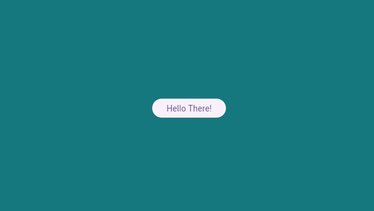

# hello_there - Flutter Test Task App

Main features:
* Background color changes after tap the screen
* Button which plays sound each time user click it 
* Supports **Web** and **Linux** targets.

---

## App View

### Main page screen


---

## Getting Started

### Prerequisites

- [Flutter SDK](https://docs.flutter.dev/get-started/install) `^3.11.0`
- [Audio Players](https://pub.dev/packages/audioplayers) `^6.6.0`
- [](https://pub.dev/packages/solid_lints)

---

## Setup & Run

### 1. Clone the repository

```bash
git clone https://github.com/Reiciak/HelloThere.git
cd HelloThere
```

### 2. Install dependencies

```bash
flutter pub get
```

### 3. Run the app

```bash
# Web (Chrome)
flutter run -d chrome

# Linux desktop
flutter run -d linux

```

### 4. Build for production

```bash
# Web (Chrome)
flutter build web

# Linux desktop
flutter build linux

```

---
